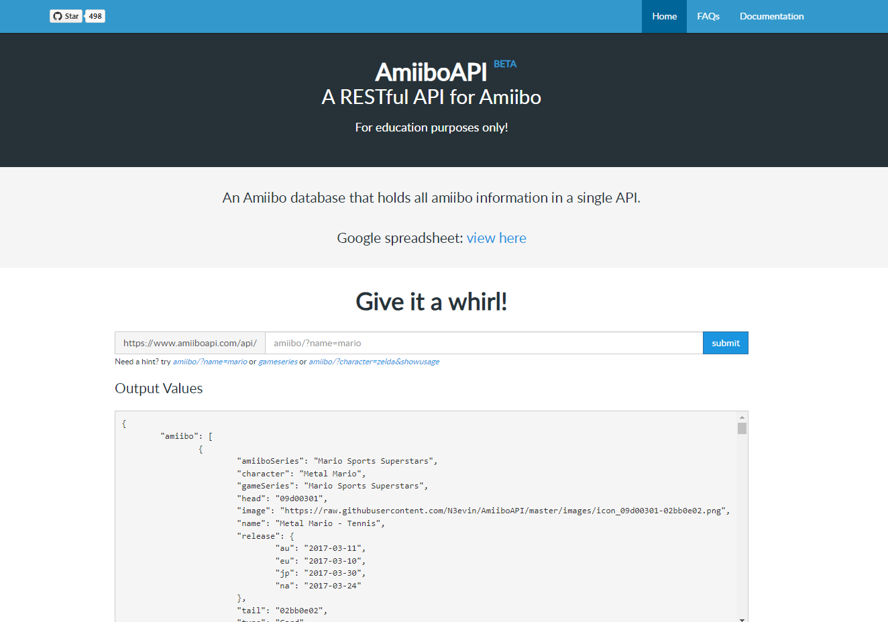
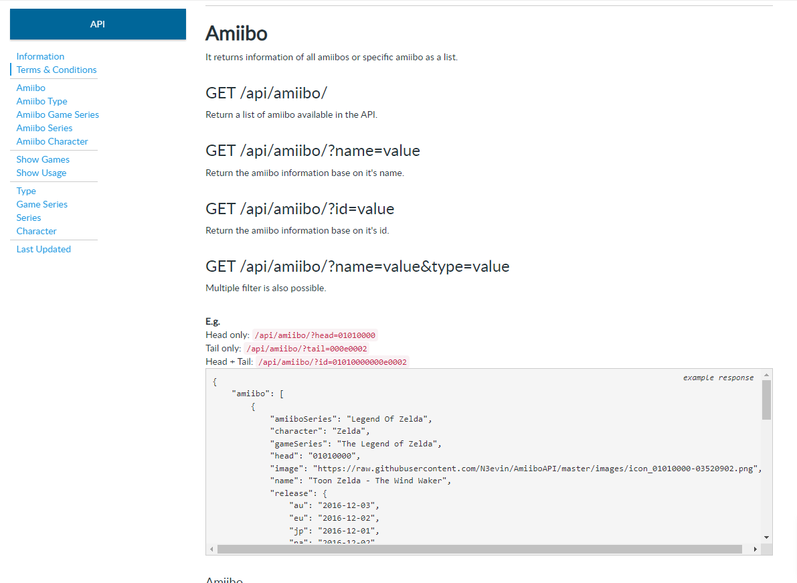
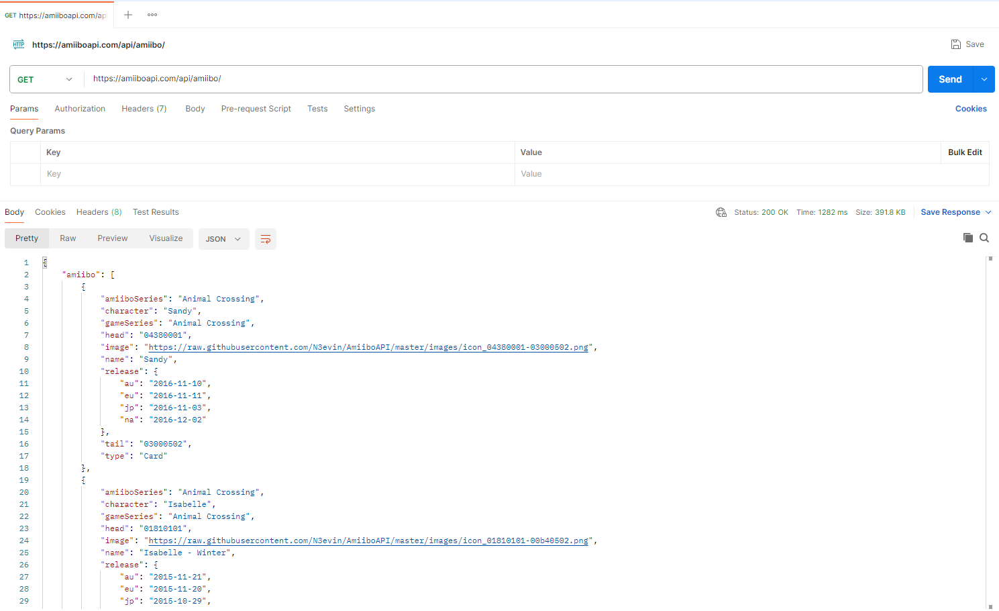

# Лабораторная работа №2
### Цель
Цель лабораторки заключается в том, чтобы описать сущность, которую вы будете забирать из внешней системы по предоставляемому API.

### API
В качестве примера будем использовать https://amiiboapi.com/.

Я решил выбрать эту api'шку по нескольким причинам:
1. мне интересно;
2. незамысловатый и понятный сайт;



3. простая документация;


4. REST API;
5. без аутентификации.

### Порядок решения

Так как задание по большей части творческое, то алгоритм будет весьма условный, тем не менее опишу обычный порядок своих действий.

В первую очередь, необходимо найти API (я очень надеюсь, что все уже нашли), и было бы круто, если оно подходит под критерии, описанные в прошлом разделе.
(Но это не требование, а рекомендация.)

Далее нужно определиться с тем, какую информацию вы планируете получать. API могут реализовывать различные методы, которые могут отдавать информацию в различном виде,
было бы неплохо для начала реализовать получение модели одного вида. Рассмотрим на примере...

Я решил, что в первую очередь хочу получать список всех доступных Amibo в сервисе.
url - https://amiiboapi.com/api/amiibo/
http method - GET



```json
{
  "amiibo": [
    {
      "amiiboSeries": "Animal Crossing",
      "character": "Sandy",
      "gameSeries": "Animal Crossing",
      "head": "04380001",
      "image": "https://raw.githubusercontent.com/N3evin/AmiiboAPI/master/images/icon_04380001-03000502.png",
      "name": "Sandy",
      "release": {
        "au": "2016-11-10",
        "eu": "2016-11-11",
        "jp": "2016-11-03",
        "na": "2016-12-02"
      },
      "tail": "03000502",
      "type": "Card"
    }
  ]
}
```

> *По факту пришло несколько тысяч записей, но для примера оставим один JSON объект.*

Дергаем запрос, получаем огромную партянку однообразных JSON объектов, то что, нам нужно!
Теперь давайте перенесем эту партянку на рельсы Java кода...


На первом уровне вложенности ответа от сервиса, мы видим одно поле, которое представляет собой массив объектов.
В нашем Java классе (или в вашем каком-нибудь классе) создаем одну поле - массив с вложенными элементами.
```java
import java.util.List;

public class AmiiboApiResponse {
    private List<AmiiboInfo> amiibo;

    // Конструкторы & аксессоры
}
```

На следующем уровне мы интерпретируем содержимое массива, информацию о наших Amibo.
В данном примере почти все данные типа ```String```, но если у вас приходит условное кол-во чего бы то ни было, 
логичнее использовать более подходящий тип данных - не стесняйтесь использовать их.
```java
public class AmiiboInfo {
    private String amiboSeries;
    private String character;
    private String gameSeries;
    private String head;
    private String image;
    private String name;
    private AmiiboReleaseInfo release;
    private String tail;
    private String type;

    // Конструкторы & аксессоры
}
```

Последний класс необходим для описания вложенного объекта.
```java
public class AmiiboReleaseInfo {
    private String au;
    private String eu;
    private String jp;
    private String na;

    // Конструкторы & аксессоры
}
```

### Итог

- Тщательно изучите документацию своего API.
- Найдите url по которому сможете получать информацию. 
- Выделите модели данных, которые хотите получать и обрабатывать.
- Создайте классы.

> Для тестирования API удобно использовать postman. Но подойдет и браузер, правда, если у вас будут POST запросы, вы запаритесь.
> 
> Если у вас будет пример аналогичный моему, очень вам советую подбирать названия полей максимально похожие на предоставляемые API названия полей.
> 
> Не стесняйтесь обращаться с вопросами)