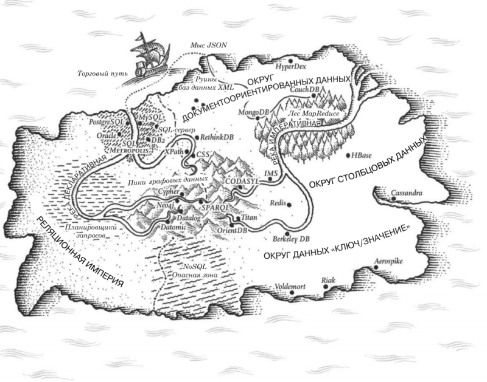

# Занятие №3 28.10.2024
## Модели данных



> Границы моего языка - это границы моего мира. *Людвиг Витгенштейн*

### Введение

***Модели данных*** одна из важнейших частей разработки программного обеспечения 
в силу оказываемого ими воздействия не только на процесс разработки, но и на наше восприятие решаемой проблемы.

Большинство приложений создаются путем наслоения одной модели данных поверх другой. Ключевой вопрос для каждого слоя:
как его представить на языке непосредственно прилегающего к нему более низкого слоя? Приведем пример:

1. Разработчик анализирует окружающий мир, выделяет так называемую "предметную область" и моделирует его на языке объектов или структур данных,
а также создает API для взаимодействия с ними.
2. При необходимости сохранить эти структуры их выражают в виде универсальной модели данных, например JSON или XML, графовой модели или таблиц в реляционной базе данных.
3. Разработчики создающие ПО для БД, в свою очередь, выбирают для себя способ представления этих данных. Благодаря этому появляется возможность отправлять запросы к данным.
4. На самом низком уровне инженеры аппаратного обеспечения решают задачи преобразования электрических импульсов в байты.

На текущем занятии мы рассмотрим группу универсальных моделей, ориентированных на хранение данных и выполнение запросов (пункт 2).
В частности, сравним реляционную модель, документоориентированную.

> ***Уточнение:*** \
> Для освоения хоть одной модели данных может потребоваться огромное кол-во времени. 
> Но поскольку от модели данных очень сильно зависит функциональность и удобство поддержки, важно иметь хотя бы минимальное представление о моделях.

### Реляционная модель данных

>Я на 90 процентов уверен, что вам знакома реляционная модель данных, 
что вы знакомы с понятием таблицы, столбцы, строки, отношения, ключи и так далее.
> 
>Однако, давайте ради приличия зафиксируем основные моменты.

***Реляционная база данных*** — это составленная по реляционной модели база данных, в которой данные, занесенные в таблицы, имеют изначально заданные отношения. 
Сами таблицы в такой базе данных также соотносятся друг с другом строго определенным образом.

Для взаимодействия с любой реляционной базой данных используется *SQL (Structured Query Language)* — язык структурированных запросов.

```
SELECT * FROM table WHERE field = {condition};
```

>Интересное замечание по поводу SQL да и в целом о языках запросов для данных.
> 
> SQL является декларативным языком и он весьма близко следует структуре реляционной алгебры.
> 
> Тема языков запросов для данных довольно интересна и полезна. Очень советую с ней ознакомиться, хотя бы вскольз. 
> Как говорится: "Лучше знать, чем не знать.".

На SQL выполняются запросы к данным в БД. Запросы обернуты в ***транзакции***.

***Транзакция*** - это комплекс последовательных операций с применением операторов SQL, имеющих определенную цель. 
Все транзакции должны отвечать четырем требованиям ACID:

 - Атомарность (англ. atomicity) — транзакция является неделимым блоком и выполняется или полностью, или никак.
 - Согласованность (англ. consistency) — завершенная транзакция сохраняет согласованность базы данных.
 - Изолированность (англ. isolation) — параллельные транзакции не могут влиять друг на друга.
 - Устойчивость (англ. durability) — никакой сбой в системе не может влиять на результат завершенной транзакции.

Если опустить вопросы отказоустойчивости, конкуретного доступа и другие глубоко технические вопросы, 
то главным преимуществом реляционной модели данных я бы выделил поддержку соединений "многие к одному" и "многие ко многим".

Но и они в свою очередь являются источниками большого количества холиваров вокруг степени нормализации, 
типа ключей (естественный / искусственный) и т.д.

Плюс ко всему, в настоящее время реляционная модель данных подвергается критике, 
т.к. большая часть разработки приложений сегодня выполняется на объектно-ориентированных языках программирования,
хранение данных в реляционных таблицах и кортежах (записях), требует наличия некоторого (как правило, неуклюжего) слоя маппинга данных 
из SQL строк в объекты. Рассмотрим на примере...

Будем работать с API которая указана на главной странице, для создания таблиц будем использовать вот такую ddl'ку...

```
CREATE TABLE game_series
(
    title               varchar NOT NULL PRIMARY KEY
);

CREATE TABLE amiibo_series
(
    title               varchar NOT NULL PRIMARY KEY,
    game_series_title   varchar NOT NULL REFERENCES game_series(title)
);

CREATE TABLE amiibo
(
    id                  int     NOT NULL GENERATED ALWAYS AS IDENTITY UNIQUE PRIMARY KEY,
    amiibo_series_title varchar NOT NULL REFERENCES amiibo_series(title),
    game_series_title   varchar NOT NULL REFERENCES game_series(title),
    character           varchar NOT NULL,
    image_link          varchar NOT NULL,
    name                varchar NOT NULL,
    type                varchar NOT NULL
);
```

Здесь мы видим реализацию связи один ко многим, использование естественных и искусственных первичных ключей.

Однако, многие специалисты считают, что использование естественных ключей нежелательно, но всегда отталкивайтесь от задачи.
Например, если бы в вышеописанном случае, я использовал стандартные интовые автогенерируемые ключи, то при добавлении записей ```amiibo```,
мне приходилось бы совершать поиск по полю ```title``` в таблицах ```amiibo_series``` и ```game_series```.

Для работы с СУБД непосредственно в коде, часто используются интерфейсы принимающие на вход SQL запрос в строковом варианте и различным образом его форматирующие:
```java
// Операция вставки сущности amiibo
// Очень важен порядок передаваемых элементов
@Override
public void insertAmiibo(Amiibo amiibo) {
    jdbcTemplate.update("INSERT INTO amiibo (amiibo_series_title, game_series_title, character, image_link, name, type) VALUES (?, ?, ?, ?, ?, ?) ON CONFLICT DO NOTHING",
            amiibo.getAmiiboSeriesTitle(), amiibo.getGameSeriesTitle(), amiibo.getCharacter(), amiibo.getImageLink(), amiibo.getName(), amiibo.getType());
}
```

```java
// Операция вставки списка сущностей amiibo
// В данном случае используется другой агрегатор SQL запросов, что позволяет привязать передаваемые параметры к названию полей класса Amiibo.
@Override
public void insertAmiibo(List<Amiibo> amiiboList) {
    SqlParameterSource[] batch = SqlParameterSourceUtils.createBatch(amiiboList.toArray());
    namedParameterJdbcTemplate.batchUpdate("INSERT INTO amiibo (amiibo_series_title, game_series_title, character, image_link, name, type) VALUES (:amiiboSeriesTitle, :gameSeriesTitle, :character, :imageLink, :name, :type) ON CONFLICT DO NOTHING", batch);
}
```

Ранее, упоминалась необходимость писать промежуточный слой логики, между чтением записи из БД и преобразованием её в объект класса, 
в следующем примере мы увидим инициализацию объекта класса ```AmiiboMapper```, который необходим как раз для этой цели.

```java
@Override
public Amiibo findAmiiboById(int id) {
    return jdbcTemplate.queryForObject("SELECT * FROM amiibo WHERE id = ?", new AmiiboMapper(), id);
}
```

```java
import java.sql.ResultSet;
import java.sql.SQLException;

public class AmiiboMapper implements RowMapper<Amiibo> {
    @Override
    public Amiibo mapRow(ResultSet rs, int rowNum) throws SQLException {
        Amiibo amiibo = new Amiibo();

        amiibo.setAmiiboSeriesTitle(rs.getString("amiibo_series_title"));
        amiibo.setGameSeriesTitle(rs.getString("game_series_title"));
        amiibo.setCharacter(rs.getString("character"));
        amiibo.setImageLink(rs.getString("image_link"));
        amiibo.setName(rs.getString("name"));
        amiibo.setType(rs.getString("type"));

        return amiibo;
    }
}
```
Конечно, писать весь этот код необязательно, ведь уже давно придумали различные *ORM* (object relation model), 
позволяющие "на горячую" получать сущности вместе с реализованными связями даже без использования SQL запросов.
Но я считаю, что они добавляют очень много "магии" в работу кода, что требует глубокого понимания основ, как работы кода, 
так и работы конкретных инструментов.

> Не поймите меня неправильно, я не отговариваю от пользования этими продвинутыми инструментами, я и сам ими активно пользуюсь.
> Я призываю лишь к "осознанному потреблению" программных инструментов.

Мы рассмотрели только две операции из стандартной четверки *CRUD*, остальные мы рассмотрим во время реализации логики сервиса.

___

### Документоориентированная модель данных

Уже несколько раз различные подходы к обработке данных пытались сместить с пьедестала реляционную модель данных.
Например, в 70-х - 80-х это была ***сетевая*** и ***иерархическая*** модели данных, затем были ***объектные*** БД, базы данных ***XML***.
Каждый соперник реляционных БД в свое время наделал много шума, но не надолго.

Самой свежей попыткой совершить изменить положение дел в сфере работы с данными является ***NoSQL*** модель.

> Название NoSQL ничего не говорит об используемой технологии, изначально оно было предложено в качестве хештега в Twitter для семинара
> по распределенным нереляционным БД. Термин задел за живое и быстро распространился в среде разработчиков.

Итак, правильнее будет, т.к. под NoSQL базами данных понимают множество нереляционных моделей данных, правильнее будет называть их "Not Only SQL",
но мы не будем сильно придирчивыми и остановимся на NoSQL, чаще всего под этим термином понимают документоориентированную БД, 
которая работает с иерархическими документами в формате JSON.

```json
{
    "amiiboSeries": "Mario Sports Superstars",
    "character": "Metal Mario",
    "gameSeries": "Mario Sports Superstars",
    "head": "09d00301",
    "image": "https://raw.githubusercontent.com/N3evin/AmiiboAPI/master/images/icon_09d00301-02bb0e02.png",
    "name": "Metal Mario - Tennis",
    "release": {
        "au": "2017-03-11",
        "eu": "2017-03-10",
        "jp": "2017-03-30",
        "na": "2017-03-24"
    },
    "tail": "02bb0e02",
    "type": "Card"
}
```

Существует несколько основных причин для использования баз данных NoSQL:

1. потребность в больших возможностях масштабирования, чем у реляционных БД, включая обработку очень больших наборов данных 
или очень быструю пропускную способность по записи;
2. предпочтение свободного программного обеспечения вместо коммерческих продуктов;
3. специализированные запросные операции, плохо поддерживаемые реляционной моделью.

Рассмотрим работу с документоориентированной БД на примере MongoDB + Spring Boot приложение.

Начнем с объявления сущности...

```java
import org.springframework.data.annotation.Id;
import org.springframework.data.mongodb.core.mapping.Document;
import org.springframework.data.mongodb.core.mapping.Field;

@Document("amiibos")
public class Amiibo {
    @Id
    private String id;
    @Field("amiibos_series")
    private String amiiboSeries;
    @Field("character")
    private String character;
    @Field("game_series")
    private String gameSeries;
    @Field("image")
    private String image;
    @Field("name")
    private String name;
    @Field("type")
    private String type;
    
    // конструкторы и аксессоры
}
```
Давайте разберемся зачем нам нужны аннотации над классом и полями:
- ```@Document``` - необходима для того, чтобы указать коллекцию в которой будут храниться сущности данного класса.
- ```@Id``` - дает понять интерфейсу СУБД, что данное поле является первичным ключом.
- ```@Field``` - отвечает за название поля, которое будет отображаться в документе в БД.

Перейдем к реализации операций добавления и поиска документа в БД.

```java
// Добавление единичного документа
@Override
public void insert(Amiibo amiibo) {
    mongoTemplate.insert(amiibo);
}

// Добавление списка документов
@Override
public void insert(List<Amiibo> amiibos) {
    mongoTemplate.insertAll(amiibos);
}

// Поиск по первичному ключу
@Override
public Amiibo findById(String id) {
    return mongoTemplate.findById(id, Amiibo.class);
}

// Поиск по конкретному полю
@Override
public List<Amiibo> findByName(String name) {
    Query query = new Query();
    query.addCriteria(Criteria.where("name").is(name));

    return mongoTemplate.find(query, Amiibo.class);
}
```
Класс ```MongoTemplate```, предоставляет более высокоуровневый интерфейс по сравнению с ```JdbcTemplate```, 
но и сам синтаксис запросов при работе с MongoDB проще, чем SQL.  

Если рассматривать вопросы связанные с разработкой и дальнейшей поддержкой какого-либо функционала, 
я бы выделил следующие плюсы документоориентированной модели.

1. JSON документы снижают рассогласованность между слоем хранения данных и кодом приложения.
2. У JSON представления - локальность лучше, чем у многотабличной схемы реляционной БД. Для извлечения одной и той же информации,
в документоориентированной БД зачастую необходимо сделать меньше запросов.
3. Реализация связи "один-ко-многим" зачастую подразумевает древовидную структуру данных, в JSON формате она становится явной.
4. Гибкость схемы в документной модели - документоориентированные БД часто называют бессхемными, 
справедливости ради стоит отметить, что схема все-таки есть (мы так или иначе описываем класс), но это так называемая schema-on-read -
интерпретация данных происходит при чтении, в отличии от schema-on-write - стандартного подхода реляционных БД.

>Различия между этими подходами особенно заметно в ситуациях, когда приложению необходимо изменить формат его данных.
> 
> Например, если мы хотим добавить новое поле в наши классы, 
> то в документоориентированной БД мы просто будем писать новые документы с новыми полями
> и добавим небольшую логику для обработки пустых полей,
> а в реляционной БД нам придется реализовывать миграцию БД с добавлением новых столбцов и обновлением данных 
> или хуже того, реализовывать версионирование БД.
___
### Итог

Не существует ультимативно лучшего или худшего решения, все зависит от задачи, которую вам необходимо решить.
Если структура данных в приложении - документоподобная (то есть представляет собой дерево связей "один-ко-многим", 
причем обычно дерево загрудается сразу), то использование документной модели будет хорошей идеей.
Однако, если в приложении используются связи "многие-ко-многим", то реляционная модель будет более привлекательна.
___
## Задание

***Необходимо:***
1. Определиться с моделью данных которую вы хотите использовать, согласно идее вашего проекта.
2. Выбрать подходящую СУБД.
3. Реализовать программное соединение с СУБД, выгрузку и сохранение в БД данных из API.

Референсы программной реализации с реляционной БД и документной БД вы можете найти в дирректориях 
```document-oriented_data_model``` & ```relational_data_model```.
___
## Полезные ссылки
1. "Высоко-нагруженные приложения" Мартин Клеппман - супер книга для понимания работы с данными в высоко-нагруженных приложениях.
2. https://stepik.org/course/551/syllabus - курс по SQL.