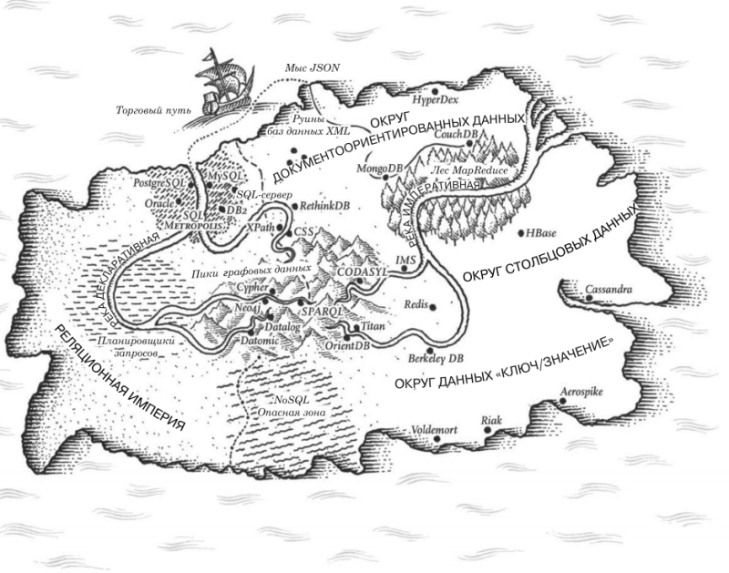

# Занятие №3 28.10.2024
## Модели данных



> Границы моего языка - это границы моего мира. *Людвиг Витгенштейн*

### Введение

***Модели данных*** одна из важнейших частей разработки программного обеспечения 
в силу оказываемого ими воздействия не только на процесс разработки, но и на наше восприятие решаемой проблемы.

Большинство приложений создаются путем наслоения одной модели данных поверх другой. Ключевой вопрос для каждого слоя:
как его представить на языке непосредственно прилегающего к нему более низкого слоя? Приведем пример:

1. Разработчик анализирует окружающий мир, выделяет так называемую "предметную область" и моделирует его на языке объектов или структур данных,
а также создает API для взаимодействия с ними.
2. При необходимости сохранить эти структуры их выражают в виде универсальной модели данных, например JSON или XML, графовой модели или таблиц в реляционной базе данных.
3. Разработчики создающие ПО для БД, в свою очередь, выбирают для себя способ представления этих данных. Благодаря этому появляется возможность отправлять запросы к данным.
4. На самом низком уровне инженеры аппаратного обеспечения решают задачи преобразования электрических импульсов в байты.

На текущем занятии мы рассмотрим группу универсальных моделей, ориентированных на хранение данных и выполнение запросов (пункт 2).
В частности, сравним реляционную модель, документоориентированную и несколько моделей данных на основе графов.

> ***Уточнение:*** \
> Для освоения хоть одной модели данных может потребоваться огромное кол-во времени. 
> Но поскольку от модели данных очень сильно зависит функциональность и удобство поддержки, важно иметь хотя бы минимальное представление о моделях.

### Реляционная модель данных

>Я на 90 процентов уверен, что вам знакома реляционная модель данных, 
что вы знакомы с понятием таблицы, столбцы, строки, отношения, ключи и так далее.
> 
>Однако, давайте ради приличия зафиксируем основные моменты.

***Реляционная база данных*** — это составленная по реляционной модели база данных, в которой данные, занесенные в таблицы, имеют изначально заданные отношения. 
Сами таблицы в такой базе данных также соотносятся друг с другом строго определенным образом.

Для взаимодействия с любой реляционной базой данных используется *SQL (Structured Query Language)* — язык структурированных запросов.

```
SELECT * FROM table WHERE field = {condition};
```

>Интересное замечание по поводу SQL да и в целом о языках запросов для данных.
> 
> SQL является декларативным языком и он весьма близко следует структуре реляционной алгебры.
> 
> Тема языков запросов для данных довольно интересна и полезна. Очень советую с ней ознакомиться, хотя бы вскольз. 
> Как говорится: "Лучше знать, чем не знать.".

На SQL выполняются запросы к данным в БД. Запросы обернуты в ***транзакции***.

***Транзакция*** - это комплекс последовательных операций с применением операторов SQL, имеющих определенную цель. 
Все транзакции должны отвечать четырем требованиям ACID:

 - Атомарность (англ. atomicity) — транзакция является неделимым блоком и выполняется или полностью, или никак.
 - Согласованность (англ. consistency) — завершенная транзакция сохраняет согласованность базы данных.
 - Изолированность (англ. isolation) — параллельные транзакции не могут влиять друг на друга.
 - Устойчивость (англ. durability) — никакой сбой в системе не может влиять на результат завершенной транзакции.

Если опустить вопросы отказоустойчивости, конкуретного доступа и другие глубоко технические вопросы, 
то главным преимуществом реляционной модели данных я бы выделил поддержку соединений "многие к одному" и "многие ко многим".

Но и они в свою очередь являются источниками большого количества холиваров вокруг степени нормализации, 
типа ключей (естественный / искусственный) и т.д.

Плюс ко всему, в настоящее время реляционная модель данных подвергается критике, 
т.к. большая часть разработки приложений сегодня выполняется на объектно-ориентированных языках программирования,
хранение данных в реляционных таблицах и кортежах (записях), требует наличия некоторого (как правило, неуклюжего) слоя маппинга данных 
из SQL строк в объекты. Рассмотрим на примере...

