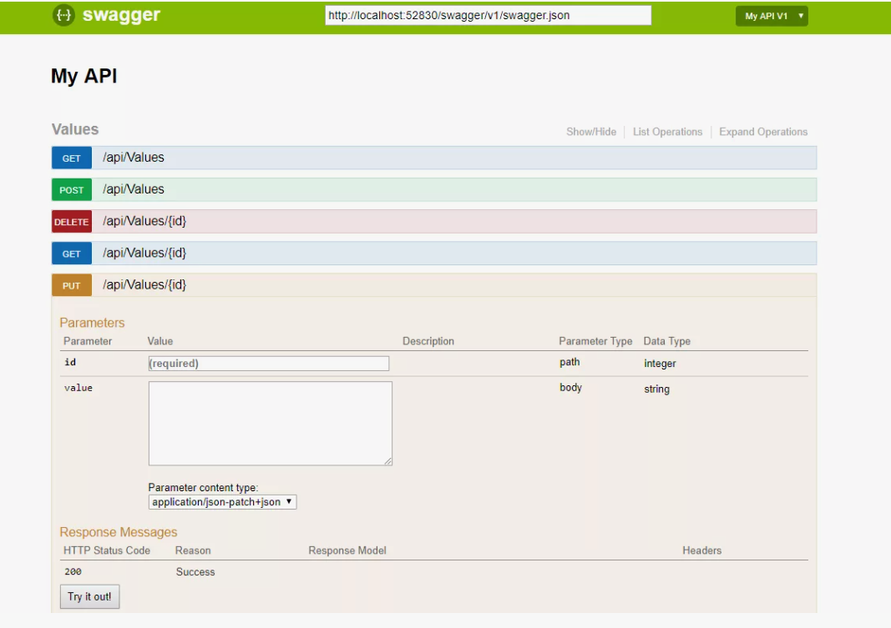

# Занятие №5 18.11.2024
## Микросервисная архитектура, сетевое взаимодействие между приложениями

Так или иначе, большинство современных приложений взаимодействуют с сетью. 
Из сети приложения или получают данные, или являются поставщиками, или все сразу.
Перед тем как разобрать, что такое микросервисная архитектура, мы разберем, основные моменты сетевого взаимодействия приложений.

### Сетевое взаимодействие

Существует несколько различных способов организации взаимодействия процессов по сети. 
Наиболее часто используемый вариант включает два вида ролей: клиенты и серверы. 
Серверы предоставляют видимый по сети API, а клиенты могут к ним подключаться и выполнять запросы к этому API. 
Предоставляемый сервером API называется сервисом.
Только что мы описали так называемую клиент-серверную архитектуру.

Чаще всего в качестве клиента представляют браузер, но выполняемые нами проекты показывают, что клиентами зачастую выступают другие сервисы,
которые в свою очередь выступают "серверами" для других сервисов и так далее...

В некоторых аспектах сервисы напоминают БД: они обычно предоставляют клиентам возможность отправлять и запрашивать данные. Однако в то время, как базы допускают произвольные запросы с помощью языков запросов, сервисы предоставляют API, свой для каждого приложения, допускающий только предопределенные бизнес-логикой (кодом приложения) сервиса входные и выходные данные.
Это ограничение обеспечивает некую степень инкапсуляции: 
сервисы получают возможность в деталях ограничивать то, что разрешено и не разрешено делать клиентам.

Если в качестве базового протокола для связи с сервисом используется HTTP,
то такой сервис называется веб-сервисом. Вероятно, это не совсем правильное наименование, поскольку веб-сервисы применяются не только для работы в Интернете, но и в нескольких других контекстах. 
Рассмотрим примеры.
1. Запущенное на пользовательском устройстве клиентское приложение (например, мобильное приложение) выполняет запросы к сервису по протоколу HTTP. 
Эти запросы обычно передаются через общедоступный Интернет.
2. Сервисы, относящиеся к одной организации, зачастую расположенные в одном ЦОДе, выполняют запросы друг к другу в рамках сервис-ориентированной/микросервисной архитектуры 
(поддерживающее подобные сценарии использования программное обеспечение иногда называется промежуточным ПО / back-to-back).
3. Сервисы, относящиеся к разным организациям, выполняют запросы друг к другу обычно через Интернет. Применяется для обмеа данными между серверными системами разных организаций. 
Эта категория включает предоставляемые онлайн-сервисами общедоступные API, например системы обработки платежей по кредитным картам или OAuth для совместного доступа к пользовательским данным.

Существует два популярных подхода к проектированию веб-сервисов: REST и SOAP. 
Эти подходы практически противоположны и часто становятся объектом жарких дискуссий среди их сторонников.

#### REST
REST не протокол, а скорее подход к проектированию, основанный на принципах HTTP. 
Базис необходимый для работы с REST заключается в знании типов HTTP методов (GET, POST, PUT ...), понимание различий HTTP ответов (2xx, 3xx, 4xx, 5xx), понимание отличий заголовков запроса от параметров.

REST делает акцент на простых форматах данных, применении URL для идентификации ресурсов и использовании возможностей HTTP для управления кэшем, аутентификации и согласования типа контента. 
REST становится все более популярным по сравнению с SOAP, по крайней мере в контексте интеграции сервисов между организациями, и часто ассоциируется с микросервисами.
API, спроектированный в соответствии с принципами REST, называют воплощающим REST (RESTful).

Воплощающие REST API имеют предрасположенность к более простым подходам, включающим обычно генерацию меньшего количества кода и использование автоматизированных утилит. 
Для описания воплощающих REST API и создания документации можно применить такой формат описания, как OpenAPI, известный также под названием Swagger.

#### SOAP
Напротив, SOAP — основанный на формате XML протокол для выполнения запросов к сетевым API2. 
Будучи применяемым чаще всего по HTTP, он стремится к независимости от последнего и избегает использования большинства его возможностей. 
Вместо этого к нему прилагается масса разнообразных сопутствующих стандартов (фреймворк веб-сервисов, известный под названием WS-*), 
которые добавляют в него различные возможности.

API SOAP веб-сервиса описывается с помощью основанного на XML языка, именуемого языком описания веб-сервисов (web services description language, WSDL). 
Последний позволяет генерировать код, так что клиент может обращаться к удаленным сервисам путем локальных классов и вызовов методов (кодируемых в XML-сообщениях и декодируемых снова фреймворком). 
Это подходит для языков программирования со статической типизацией, но менее удобно в языках с динамической.

Поскольку WSDL не предназначен для чтения людьми, а SOAP-сообщения часто слишком сложны для того, чтобы их можно было сформировать вручную, пользователи SOAP сильно зависят от поддержки утилит, генерации кода и различных IDE. 
Для пользователей тех языков программирования, которые не поддерживаются производителями реализаций SOAP, интеграция с сервисами SOAP представляет непростую задачу.
Хотя SOAP и многочисленные его расширения вроде бы стандартизированы, взаимодействие между его реализациями от различных производителей часто приводит к проблемам. 
В силу этих причин, хотя SOAP и используется во многих крупных организациях, в большинстве малых фирм он вышел из моды.

#### Итог
Мы кратко рассмотрели два основных подхода к реализации сетевого взаимодействия.
В этой части не было примеров, т.к. в качестве примеров REST'a, вы можете взять собственные проекты (или на крайний случай мой),
а примеров SOAP у меня пока нет, т.к. технология не популярная и я с ней ни разу не работал. 
Но когда-нибудь я чего-нибудь напишу с SOAP и закину сюда.

Также мы не рассмотрели набирающую популярность технологию RPC, в частности gRPC. И взаимодействие с помощью брокеров сообщений типа Kafka и RabbitMQ.
Т.к. времени мало, а поработать хоть с чем-нибудь надо.

> *Все описанное в "итогах" очень любят спрашивать на собесах, так что настоятельно рекомендую ознакомиться.*

#### Микросервисная архитектура

Подход когда сервис выступает в роли клиента в отношениях с сервисом 1 и сервером в отношении с сервисом 2, можно назвать микросервисным.
Такой подход часто используется для декомпозиции больших приложений на небольшие сервисы по областям функциональности, 
чтобы сервисы выполняли запросы друг к другу в случае потребности в какой-либо функциональности или данных.
Подобный метод создания приложений традиционно назывался сервисориентированной архитектурой (service-oriented architecture, SOA), 
а в последнее время подвергся пересмотру и получил новое название: микросервисная архитектура (microservices architecture).

В итоге, что же такое MSA.
MSA — принципиальная организация распределенной системы на основе микросервисов и их взаимодействия друг с другом и со средой по сети, 
а также принципов, направляющих проектирование архитектуры, её создание и эволюцию.

Микросервис же - это отдельный, независимый компонент информационной системы, который (в идеале) выполняет одну техническую или бизнес задачу.

Микросервис должен обладать следующими свойствами:

1. Он небольшой.
2. Он независимый.
3. Он строится вокруг бизнес-потребности и использует ограниченный контекст (Bounded Context).
4. Он взаимодействует с другими микросервисами по сети на основе паттерна Smart endpoints and dumb pipes.
5. Его распределенная суть обязывает использовать подход Design for failure.
6. Централизация ограничена сверху на минимуме.
7. Процессы его разработки и поддержки требуют автоматизации.
8. Его развитие итерационное.

Если суммировать все эти принципы в каком-то конкретном примере, то это наш с вами проект. 
По плану он содержит две небольшие части, которые выполняют одну бизнес-задачу. 
Они не зависят друг от друга.
Наши микросервисы несут в себе смысл для решения конкретной (придуманной нами) бизнес-задачи.

### Итог

Эта "лекция" завершает основной блок изучения разработки программных приложений.
Я постарался сжать до атома свой опыт и предоставить его вам вместе с необходимыми источниками.
В первую очередь на наших парах, я хотел дать вам не способ реализации чего-либо, а понимание. 
На мой взгляд самое сложное это сформировать мышление, а не научиться работать с инструментом.
Следующие лекций будут своеобразными мастер-классами по сопутствующим в разработке технологиям.

___
## Задание

1. Доделать все задачи из бэклога.
2. Реализовать контроллер вашего микросервиса.
3. Обратить внимание на "полезные ссылки" в каждом занятии.

___
## Полезные ссылки

1. https://habr.com/ru/companies/raiffeisenbank/articles/346380/?code=865175ab54c8f7b3ba5c5a34bb477b10&state=5thMflY67K9560pG2stKBOuk&hl=ru - моя любимая статья про MSA.
2. https://proglib.io/p/18-osnovnyh-patternov-mikroservisnoy-arhitektury-2024-07-23?ysclid=m3m1hpiyu6267662262 - статья для того, чтобы вы понимали что такое "Smart endpoints and dumb pipes".
3. Высоконагруженные приложения. Мартин Клеппман. Глава 4. - второй раз упоминаю эту суперскую книгу, пиратство это конечно зло, но кто ищет тот всегда найдет...
4. https://habr.com/ru/articles/215117/ - база про HTTP