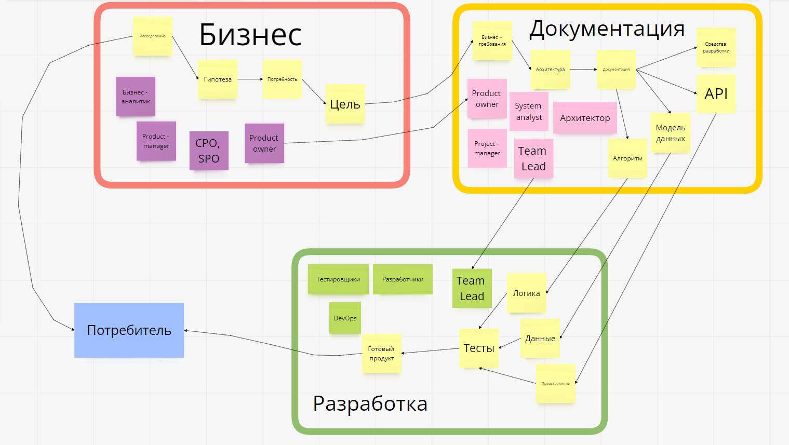

# Занятие №1 30.09.2024
## Вводное занятие

> ***Дисклеймер:*** 
> 
> Еще раз представлюсь, меня зовут Роман Орлов, 
> уже больше двух лет я работаю backend - разработчиком в одном не самом маленьком Российском банке.
> 
> По совместительству, я являюсь магистром 1 курса.
> 
> На занятиях я буду делиться личным опытом и наблюдениями, которые получил во время работы.
> Прошу учитывать, что от компании к компании все может отличаться.

### Что такое программное приложение?

Вообще, термин странный, конкретной его трактовки я не нашел. Нейросетка от яндекса выдает что-то такое:
> Программное приложение — это прикладная программа, которая помогает пользователю решать конкретные задачи.
> 
> К программным приложениям относятся, например: текстовые и графические редакторы, браузеры, офисные приложения, игры и другие. Приложения могут быть не только на компьютерах, но и на смартфонах и планшетах.
> 
> Также онлайн-сервисы также считаются прикладным программным обеспечением — это такие же программы, но размещены они на удалённых серверах.
> 
> В целом, программное обеспечение — это совокупность всех программ, предназначенных для выполнения на компьютере.

Давайте попробуем декомпозировать это понятие по "зонам ответственности":

Программное приложение - это 
- прикладная программа - то есть что-то *про разработку* и т.д. и т.п.
- помогает пользователю решать конкретные задачи - то есть что-то про *цель создания* этого приложения.

На основе нехитрой вышеописанной декомпозиции можем условно разделить приложение на два слоя:
- слой реализации - отвечает на вопрос "как?";
- слой бизнеса - отвечает на вопрос "зачем?".

Теперь расставим вопросы в правильном порядке:
- ***Зачем*** нам что-то разрабатывать?
- ***Как*** мы это реализуем?

Вот мы и подошли к кульминации, нашего небольшого эксперимента, 
мы выделили первые два основных этапа разработки любого нового приложения / фичи / доработки и т.д. и т.п.

- **Анализ**, формирование бизнес - требований (БТ).
- **Описание будущей разработки**, создание архитектуры, ТЗ, аналитики и т.д. (ФТ).
- **Разработка** - третий этап который опускается во всех определениях т.к. это очевидно, кто-то должен разработать что-то, 
иначе все вышеописанное не имеет смысла.

### А кто все это будет делать?

> *Вот они слева направо...*

Разберем на примере моей команды:

- Product owner (владелец продукта, PO) - специалист отвечающий за то, чтобы продукт выполнял поставленную перед ним бизнес-задачу.
- Team lead - специалист, который отвечает за техническую сторону продукта.
- System analyst (системный аналитик, SA) - в моей команде, системный аналитик занимается низкоуровневым проектированием разрабатываемой системы.
- Backend - developer, frontend - developer - ну тут все понятно, правда ведь?
- QA manual, QA automation - тестировщики занимаются анализом документации и на ее основе выявлением багов.
- Дизайнер - отвечает за... дизайн...

В разное время, приходили и уходили иные специалисты, но костяк мы рассмотрели.

В качестве вывода сделаем небольшую схему.

> Она также присутствует у нас на рабочей доске.

___
## Задание на семестр

Итак, мы кратко разобрали процесс разработки, с моей точки зрения, то есть с точки зрения разработки.

Вашим заданием на весь семестр будет разработка приложения следующей конфигурации:

Разработка должна вестись в командах, тематика приложения условная.
Мы опустим детали бизнес анализа и перейдем непосредственно к разработке.
Средства разработки на ваш выбор, в рамках лекции будем рассматривать разработку на примере веб-приложения на Java + Spring. 